## GC 的认识

### 1. 什么是 GC，有什么作用？

GC，全称 Garbage Collection，即垃圾回收，是一种自动内存管理的机制。当程序向操作系统申请的内存不再需要时，垃圾回收主动将其回收并供其他代码进行内存申请时候复用，或者将其归还给操作系统，这种针对内存级别的资源的自动回收过程，即为垃圾回收，而负责垃圾回收的程序组件，即为垃圾回收器。垃圾回收其实一个完美的“Simplicity is Complicated”的例子。一方面程序员受益于 GC，无需操心、也不再需要对内存进行手动的申请和释放操作，GC 在程序运行时自动释放残留过多的内存。另一方面 GC 对程序员几乎不可见，仅在需要程序进行特殊优化时候，通过提供可调控的 API，对 GC 的运行时机、运行开销进行把控时候才得以现身。

通常，垃圾回收器的执行过程通常被划分为两个半独立的组件：

- 赋值器（Mutator）：这一名称本质上是在指代用户态的代码。因为对垃圾回收器而言，用户态的代码仅仅只是在修改对象之间的引用关系，也就是对象图（对象之间引用关系的一个有向图）进行操作。
- 回收器（Collector）：负责执行垃圾回收的代码。

### 2. 根对象到底是什么？

根对象在垃圾回收的术语中又叫做根集合，它是垃圾回收器在标记过程时最先检查的对象，如图 1 所示。包括：

1. 全局变量：程序在编译期就能确定的那些存在于程序整个生命周期的那些变量
2. 执行栈：每个 goroutine 都包含自己的执行栈，这些执行栈上包含栈上的变量及指向分配的内存区块的指针
3. 寄存器：寄存器的值可能表示一个指针，参与计算的这些指针可能指向某些赋值器分配的内存区块

### 3. 常见的 GC 实现方式有哪些？Go 语言的 GC 使用的什么？

所有的 GC 算法其存在形式可以归结为追踪（Tracing）和引用计数（Reference Counting）这两种形式的混合运用。

- 追踪式 GC 的核心思想在于：从根对象出发，根据对象之间的引用信息，一步步推进直到扫描完毕整个堆、并确定需要保留的对象，从而回收所有可以回收的对象。例如 Go、 Java、V8 的 JavaScript 实现等均为追踪式 GC。
- 引用计数式 GC 的核心思想在于：每个对象自身包含一个被引用的计数器，当计数器归零时自动得到回收。因为此方法缺陷较多，在追求高性能时通常不被应用，例如：Python、Objective-C 等均为引用计数式 GC。

目前比较常见的 GC 实现方式包括：

- 追踪式，分为多种不同类型，例如：

  - 标记清扫：从根对象出发，将确定存活对象进行标记，并清扫可以回收的对象。
  - 标记整理：为了解决内存碎片问题而提出，在标记过程中，将对象尽可能整理到一块连续的内存上。
  - 增量式：将标记与清扫的过程分批执行，每次执行很小的部分，从而增量的推进垃圾回收，达到近似实时、几乎无停顿的目的。
  - 增量整理：在增量式的基础上，增加对对象的整理过程。

  - 分代式：将对象从存活时间的长短进行分类，存活时间小于某个值的为年轻代，存活时间大于某个值的为老年代，永远不会参与回收的对象为永久代，并根据分代假设（如果一个对象存活时间不长则倾向于被回收，如果一个对象已经存活很长时间则倾向于存活更长时间）对对象进行回收。

- 引用计数：根据对象自身的引用的计数来回收，当引用数归零时立即回收。

关于各类方法各种详细介绍及其实际实现不在本文中详细讨论，对于 Go 而言，Go 的 GC 目前使用的是无分代（对象没有代际之分）、不整理（回收过程中不对对象进行移动与整理）、并发（与用户代码并发执行）的三色标记清扫算法。

### 4. 三色标记法是什么？Go 如何实现？三色标记法的优势是什么？

理解三色标记法的关键是理解对象的颜色抽象以及波面（wavefront）推进这一概念。三色抽象只是一种描述追踪式回收器的一种方法，在实践中并没有实际含义，它的重要作用在于从逻辑上严密推导标记清理这种垃圾回收方法的正确性，也就是说，当我们谈及三色标记法时，通常指标记清扫的垃圾回收。

从垃圾回收器的视角来看，三色抽象规定了三种不同类型的对象，并用不同的颜色相称：

- 白色对象（可能死亡）：未被回收器访问到的对象。在回收开始阶段，所有对象均为白色，当回收结束后，白色对象均不可达。
- 灰色对象（波面）：已被回收器访问到的对象，但回收器需要对其中的一个或多个指针进行扫描，因为他们可能还指向白色对象。
- 黑色对象（确定存活）：已被回收器访问到的对象，其中所有字段都已扫描，黑色对象中任何一个指针都不可能直接指向白色对象。

这样三种不变性所定义的回收过程其实是一个波面不断前进的过程，这个波面同时也是黑色对象和白色对象的边界，灰色对象就是这个波面。

当垃圾回收开始时，只有白色对象。当标记过程开始进行时，灰色对象开始出现（着色），这时候波面便开始扩大。当一个对象的所有子节点均完成扫描时，会被着色为黑色。当整个堆遍历完成时，只剩下黑色和白色对象，这时的黑色对象为可达对象，即存活；而白色对象为不可达对象，即死亡。这个过程可以视为以灰色对象为波面，将黑色对象和白色对象分离，使波面不断向前推进，直到所有可达的灰色对象都变为黑色对象为止的过程，如图 1所示。

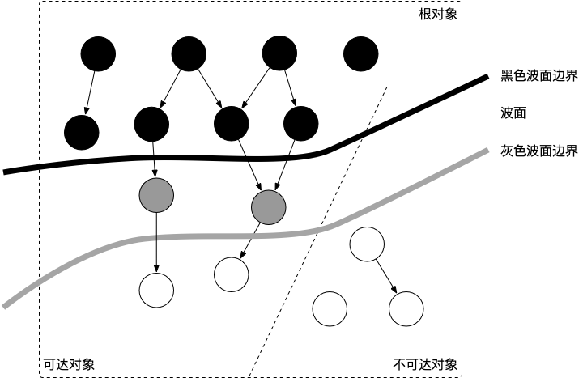

_图 1：三色标记法全貌。图中展示了根对象、可达对象、不可达对象、黑、灰、白对象以及波面之间的关系。_

### 5. STW 是什么，Go 为什么要一直尝试减少 STW 时间，真那么有用吗？

STW 是 Stop the World 的缩写，即万物静止，是指在垃圾回收过程中为了保证实现的正确性、防止无止境的内存增长等问题不可避免的需要停止赋值器进一步操作对象图的一段过程。在这个过程中整个用户代码被停止或者放缓执行，可想 STW 越长，对用户代码造成的影响（例如延迟）就越大，早期 Go 对垃圾回收器的实现中 STW 长达几百毫秒，可想着对时间敏感的实时通信等应用程序会造成巨大的影响。我们来看一个例子：

```go
package main

import (
	"runtime"
	"time"
)

func main() {
	go func() {
		for {
		}
	}()

	time.Sleep(time.Millisecond)
	runtime.GC()
	println("OK")
}
```

上面的这个程序在 Go 1.14 以前永远都不会输出 OK，其罪魁祸首是 STW 无限制的被延长。尽管 STW 如今已经优化到了半毫秒级别一下，但这个程序被卡死原因在于仍然是 STW 导致的。原因在于，GC 在进入 STW 时，需要等待让所有的用户态代码停止，但是 `for {}` 所在的 goroutine 永远都不会被中断，从而停留在 STW 阶段。实际实践中也是如此，当程序的某个 goroutine 长时间得不到停止，强行拖慢 STW，这种情况下造成的影响（卡死）是非常可怕的。好在在 Go 1.14 之后，这类 goroutine 能够被异步的抢占，从而 STW 的时间如同普通程序那样，不会超过半个毫秒，程序也不会因为仅仅等待一个 goroutine 的停止而停顿在 STW 阶段。

### 6. 有了 GC，为什么还会发生内存泄露？

在一个具有 GC 的语言中，常说的内存泄漏严谨的来说应该描述为：预期的能很快被释放的内存由于附着在了长期存活的内存上、或生命期意外的被延长，从而预计能够立即回收的内存而长时间得不到回收。在 Go 中，由于 goroutine 的存在，所谓的内存泄漏除了附着在长期对象上之外，还存在多种不同的形式。

- **形式1：预期能被快速释放的内存因被根对象引用而没有得到迅速释放。**当有一个全局对象时，可能不经意间将某个变量附着在其上，且忽略的将其进行释放，则该内存永远不会得到释放。例如：

```go
var cache map[interface{}]interface{}
func main() {
  for i := 0; i < 100000; i++ {
    m := make([]byte, 1<<10)
    cache[i] = m
  }
}
```

- **形式2：goroutine 泄漏。** goroutine 作为一种逻辑上理解的轻量级线程，需要维护用户代码的执行上下文信息，因此它在运行时中也需要消耗一定的内存来保存这类信息。而这些内存在目前版本（Go 1.14）的 Go 中是不会被释放的。因此，如果一个程序持续不断的产生新的 goroutine、且不结束执行已经创建的 goroutine 并复用这部分内存，则会造成内存泄漏的现象，例如：

```go
package main
import (
    "os"
    "runtime/trace"
)
func main() {
    trace.Start(os.Stderr)
    defer trace.Stop()
    for i := 0; i < 100000; i++ {
        go func() {
            select{}
        }
    }
}
```

```shell
go run main.go 2> trace.out
```


这种 goroutine形式的泄漏还可能由 channel 泄漏导致。channel 的泄漏本质上与 goroutine 泄漏存在直接联系。channel 作为一种同步原语，会连接两个不同的 goroutine，如果一个 goroutine 尝试向一个没有接收方的无缓冲 channel 发送消息，则该 goroutine 会被永久的休眠，整个 goroutine 及其执行栈都得不到释放。

### 7. 标记清除法和并发标记清除法的区别是什么？

在没有用户态代码并发修改三色抽象的情况下，回收可以正常结束。但并发回收的根本问题在于，用户态代码在回收过程中会并发的更新对象图，从而赋值器和回收器可能对对象图的结构产生不同的认知，这时以一个固定的三色波面作为回收过程前进的边界则不再合理。我们不妨考虑赋值器的写操作的例子：

| 时序 | 回收器               | 赋值器             | 说明                                                         |
| ---- | -------------------- | ------------------ | ------------------------------------------------------------ |
| 1    | shade(A, gray)       |                    | 回收器：根对象的子节点着色为灰色对象                         |
| 2    | shade(A.ref2, black) |                    | 回收器：当所有子节点着色为灰色后，将节点着为黑色             |
| 3    |                      | Write(C.ref3, B)   | 赋值器：并发的修改了 C 的子节点                              |
| 4    |                      | Write(C.ref1, nil) | 赋值器：并发的修改了 C 的子节点                              |
| 5    | shade(A.ref1, gray)  |                    | 回收器：进一步扫描着色为灰色对象的子节点着色为灰色对象，这时由于 `C.ref1` 为 `nil`，什么事情也没有发生 |
| 6    | shade(A, black)      |                    | 回收器：由于所有子节点均已标记，回收器也不会重新扫描已经被标记为黑色的对象，此时 A 被着色为黑色，进而 B 在此次回收过程中永远不会被标记为黑色，进而错误的回收。 |

- 初始状态：假设某个黑色对象 C 指向某个灰色对象 A ，而 A 指向白色对象 B；
- `Write(C.ref3, Read(A.ref1))`：而此时赋值器并发的将黑色对象 C 指向（ref3）了白色对象 B；
- `Write(C, ref1, nil)`：并将灰色对象 A 对白色对象 B 的引用移除（ref2）；
- 最终状态：则在继续扫描的过程中，白色对象 B 永远不会被标记为黑色对象了（回收器不会重新扫描黑色对象），进而产生被错误回收的对象 B。


总而言之，并发标记清除中面临的一个根本问题就是如何使标记与清除过程保证其正确性。

### 8. 什么是写屏障、混合写屏障，如何实现？

要讲清楚写屏障，就需要理解三色标记清扫算法中的强弱不变性以及赋值器的颜色。
写屏障、混合写屏障是一个在并发垃圾回收器才会出现的概念，如前面所说，无条件的标记清扫可能导致对象出现丢失。从原理上讲，当以下两个条件同时满足时会导致对象丢失：

- 条件 1: 赋值器将某一白色对象引用写入黑色对象；
- 条件 2: 从灰色对象出发，到达白色对象的路径被赋值器破坏。

因此只要能够避免其中任何一个条件，则不会出现对象丢失。我们不妨将三色不变性所定义的波面根据这两个条件进行削弱，当满足原有的三色不变性定义的情况称为强三色不变性（strong tricolor invariant），即不存在黑色对象指向白色对象的指针；当赋值器在黑色对象中写入对白色对象的引用时（条件 1）的情况称为弱三色不变性（weak tricolor invariant），即所有黑色对象引用的白色对象都处于灰色保护状态（直接或间接从灰色对象可达）。当赋值器进一步破坏灰色对象到达白色对象的路径时（条件 2），即打破弱三色不变性，则也就破坏了回收器的正确性。

可见，在破坏强弱三色不变性时必须引入额外的辅助操作。

如果我们考虑并发的用户态代码，回收器不允许同时停止所有赋值器，就是涉及了存在的多个不同状态的赋值器。从而我们可以引入赋值器的颜色：

- 黑色赋值器：已经由回收器扫描过（回收器已完成根集合的追踪）不会再次对其进行扫描
- 灰色赋值器：尚未被回收器扫描过（回收器的根集合尚未被追踪到），或尽管已经扫描过但仍需要重新扫描

赋值器的颜色对回收周期的结束产生影响。如果某种并发回收器允许灰色赋值器的存在，则必须在回收结束之前重新扫描赋值器的根。如果重新扫描过程中发现了新的灰色或白色对象，回收器还需要对新发现的对象进行追踪，但是在新追踪的过程中，赋值器仍然可能在其根中插入新的非黑色引用，如此往复。因此允许灰色赋值器存在的算法，最差情况下，回收器只能将所有赋值器线程挂起才能完成其根的完成扫描，也就是我们所说的 STW。

在确保强弱三色不变性的并发指针更新操作需要通过赋值器屏障技术来保证指针的读写操作一致。因此我们所说的写屏障、混合写屏障是指赋值器的写屏障。

Go 使用的是一种灰色赋值器 Dijkstra 插入屏障和黑色赋值器 Yuasa 删除屏障混合而成的写屏障，这种形式的屏障将强三色不变性削弱为弱三色不变性，进而避免了允许灰色赋值器存在的重新扫描。混合写屏障的基本思想是：对正在被覆盖的对象进行着色，且如果当前栈尚未被扫描，则同样对安插的指针进行着色，其实现的伪代码如下：

```go
// 混合写屏障
func writePointer(slot, ptr unsafe.Pointer) {
    shade(*slot)                // 对正在被覆盖的对象进行着色，通过将唯一指针从堆移动到栈来防止赋值器隐藏对象。
    if current stack is grey {  // 如果当前 goroutine 执行栈还未被扫描为黑色
        shade(ptr)              // 则对引用进行着色，通过将唯一指针从栈移动到堆中的黑色对象来防止赋值器隐藏对象
    }
    *slot = ptr
}
```

对于弱三色不变性而言，只要存在一个能够通向白色对象的路径，黑色对象就能允许直接引用白色对象。而对于写屏障而言，总是会防止赋值器去隐藏某个对象。比如，对于 Dijkstra 屏障而言，赋值器总是可以通过将一个单一的指针移动到某个已经被扫描后的栈，从而导致某个白色对象被标记为灰色进而隐藏到黑色对象之下，进而需要对栈的重新扫描，甚至导致栈总是灰色的。

## GC 的实现细节

### 9. Go 语言中 GC 的流程是什么？

当前版本的 Go （1.14）以 STW 为界限，可以将 GC 划分为五个阶段：

| 阶段 | 说明 | 赋值器状态 |
|:---:|:----:|:----:|
| GCMark | 标记准备阶段，为并发标记做准备工作，启动写屏障 | STW |
| GCMark | 扫描标记阶段，与赋值器并发执行，写屏障开启 | 并发 |
| GCMarkTermination | 标记终止阶段，保证一个周期内标记任务完成，停止写屏障 | STW |
| GCoff | 内存清扫阶段，将需要回收的内存归还到堆中，写屏障关闭 | 并发 |
| GCoff | 内存归还阶段，将过多的内存归还给操作系统，写屏障关闭 | 并发 |

具体而言，各个阶段的出发函数分别为：

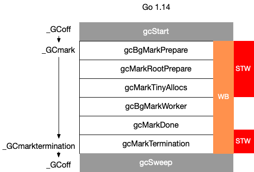

### 10. 触发 GC 的时机是什么？

Go 语言中对 GC 的触发时机存在两种形式：  
  
1. **主动触发**，通过调用 runtime.GC 来触发 GC，此调用阻塞式的等待当前 GC 运行完毕。

2. **被动触发**，分为两种方式：
  - 使用系统监控， 当超过两分钟没有产生任何 GC 时，强制触发 GC。

  - 使用调步（Pacing）算法，其核心思想是控制内存增长的比例，通过 `GOGC` 或者 `debug.SetGCPercent` 进行控制（他们控制的是同一个变量，即为堆的增长率 $\rho$）。整个算法的设计考虑的是优化问题：如果设上一次 GC 完成时，内存的数量为 $H_m$（heap marked），估计需要触发 GC 时的堆大小 $H_T$（heap trigger），使得完成 GC 时候的目标堆大小 $H_g$（heap goal） 与实际完成时候的堆大小 $H_a$（heap actual）最为接近，即 $\min |H_g - H_a| = \min|(1+\rho)H_m - H_a|$

    

    除此之外，调步算法还需要考虑 CPU 利用率的问题，显然我们不应该让垃圾回收器占用过多的 CPU 使用，即不应该让每个负责执行用户 goroutine 的线程都在执行标记过程，理想情况下，在用户代码满载的情况下，GC 的 CPU 使用率不应该超过 25%，即另一个优化问题：如果设 $u_g$为目标 CPU 使用率（goal utilization），而 $u_a$为实际 CPU 使用率（actual utilization），则 $\min|u_g - u_a|$。
  
    求解这两个优化问题的具体数学建模过程我们不在此做深入讨论，有兴趣的读者可以参考两个设计文档：[Go 1.5 concurrent garbage collector pacing](https://docs.google.com/document/d/1wmjrocXIWTr1JxU-3EQBI6BK6KgtiFArkG47XK73xIQ/edit#) 和 [Separate soft and hard heap size goal](https://github.com/golang/proposal/blob/master/design/14951-soft-heap-limit.md)。但计算 $H_T$ 的最终结论（从 Go 1.10 时开始）是：
  
    - 设第 n 次触发 GC 时，估计得到的堆增长率为 $h_T^{(n)}$、运行过程中的实际堆增长率为 $h_a^{(n)}$、标记辅助花费的时间 $t_A$，用户设置的增长率为 $\rho = \text{GOGC}/100$（ $\rho > 0$）则第 $n+1$ 次出触发 GC 时候，估计的堆增长率为：
  
      $$
      h_T^{(n+1)} = h_T^{(n)} + 0.5 \left[ \rho - h_T^{(n)} - \frac{0.25 t_A^{(n)}}{0.3} \left( h_a^{(n)} - h_T^{(n)} \right) \right]
      $$

    - 特别的，当 $n=0$ 时，标记辅助的时间 $t_A = 0$，且令 $h_t^{(0)} = 0.875$，即第一次触发 GC 时：
      $$
      h_T^{(1)} = \frac{1}{2}\left[ \frac{7}{8} + \rho \right]
      $$
      
    - 当 $h_T<0.6$时，将其调整为 $0.6$，当 $h_T > 0.95 \rho$ 时，将其设置为 $0.95 \rho$

    - 默认情况下，$\rho = 1$（即 GOGC = 100），第一次出发 GC 时，$h_T^{(1)} = 0.9375$，由于默认的最小堆大小为 4MB，因此当程序消耗 3.75MB 时，触发第一次 GC，可以写如下程序进行验证：
  
      ```go
      package main
      
      import (
      	"os"
      	"runtime"
      	"runtime/trace"
      	"sync/atomic"
      )
      
      var stop uint64
      
      func gcfinished() *int {
      	p := 1
      	runtime.SetFinalizer(&p, func(_ *int) {
      		println("gc finished")
      		atomic.StoreUint64(&stop, 1)
      	})
      	return &p
      }
      
      func allocate() {
      	// 每次调用分配 0.25MB，第一次触发 GC 时，此函数被调用了 15 次
      	_ = make([]byte, int((1<<20)*0.25))
      }
      
      func main() {
      	f, _ := os.Create("trace.out")
      	defer f.Close()
      	trace.Start(f)
      	defer trace.Stop()
      	gcfinished()
      	for n := 1; atomic.LoadUint64(&stop) != 1; n++ {
      		println("#allocate: ", n)
      		allocate()
      	}
      	println("terminate")
      }
      ```
  
      ```
      go tool trace trace.out
      ```
  
      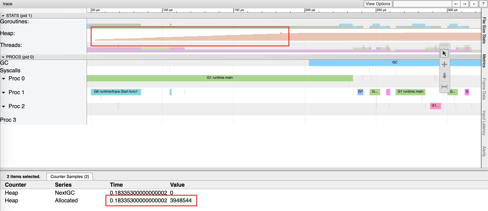
  
      便能发现，根据 Heap 数值上升的阶梯状来看，当进行第 16 次阶梯式上升（内存分配）时，此时已经在堆中分配了 3948544 / (1025 * 1024) 约等于 3.76 MB，符合理论上计算的 15 * 0.25MB = 3.75MB，时，GC开始被触发。
      
      我们再来根据调试信息验证一下下一个GC触发时的堆大小：
      
      - 首先，从记录中可以看到，标记辅助所消耗的时间为 $t_A = 354017/(4*68182) \approx 1.3$
      
        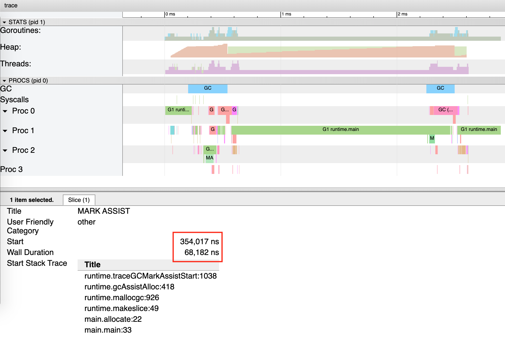
      
      - 运行过程中的实际堆增长率为 $h_a^{(1)} = (3948544-3936000)/3936000 = 0.0031$
      
      - 根据第一次 GC 得到的结果，估计得到的堆增长率为 

        $$
        h_T^{(2)} = h_T^{(1)} + 0.5 \left[ 1 - h_T^{(1)} - \frac{0.25 \times 1.3}{0.3} \left(0.0031 - h_T^{(1)}\right) \right] = 0.9375 + 0.5 (1 - 0.9375 - 1.083(0.0031 - 0.9375)) \approx 1.4747
        $$
        
        数值超过 0.95，因此最终的 $h_T^{(2)} = 0.95$，则再次触发 GC 时的堆大小为 0.95*4MB = 3.8 MB。
      
      - 根据实际所记录的数据 4022528/(1024*1024)约等于 3.83MB，符合理论计算结果。
      
        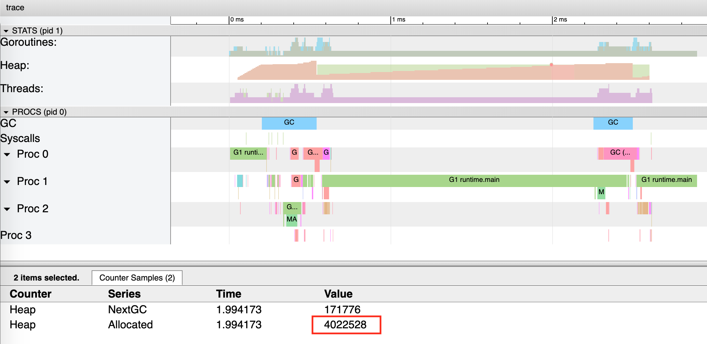

### 11. 如果内存分配速度超过了标记清除的速度怎么办？是怎么实现的？

目前的 Go 实现中，当 GC 触发后，会首先进入并发标记的阶段。并发标记会设置一个标志，并在 mallocgc 调用进行检查。当存在新的内存分配时，会暂停分配内存过快的那些 goroutine，并将其转去执行一些辅助标记的工作（Mark Assist），从而达到放缓继续分配、辅助 GC 的标记工作的目的。

## GC 的优化问题

### 12. 如何观察 Go GC？

观察 Go 的 GC 目前由四种不同的方式：
#### 方式1：`GODEBUG=gctrace=1`

TODO:

#### 方式2：`debug.ReadGCStats`

TODO:

#### 方式3：`runtime.ReadMemStats`

TODO:

#### 方式4：`go tool trace`

TODO:


### 13. GC 关注的指标有哪些？

Go 中的 GC 被设计为成比例触发、大部分工作与赋值器并发、不分代、无内存移动且会主动向操作系统归还申请的内存。因此最主要关注的能够影响赋值器的性能指标有：

- CPU 利用率：回收算法会在多大程度上拖慢程序？有时候，这个是通过回收占用的 CPU 时间与其它 CPU 时间的百分比来描述的。
- GC 停顿时间：回收器会造成多长时间的停顿？
- GC 停顿频率：回收器造成的停顿频率是怎样的？
- GC 可扩展性：当堆内存变大时，垃圾回收器的性能如何

### 14. Go 的 GC 如何调优？

所谓 GC 的调优的核心思想是：优化内存的申请速度，尽可能的少申请内存，复用已申请的内存（例如 sync.Pool）。Go 自身提供的调试工具（go tool pprof 与 go tool trace）能够快速帮助我们定位存在大量内存申请的位置。

#### 例1

TODO:

#### 例2
TODO:

#### 例3

TODO:

#### 总结

1. 减少返回会逃逸到堆上分配的变量，是变量作为局部变量进行分配，从而可以直接在不被垃圾回收进行清理的情况下，使整个栈供下一个 goroutine 复用。
2. 将小对象整理为一个大对象来避免内存碎片的问题
3. 使用 sync.Pool 来复用需要频繁创建临时对象
4. 使用 goroutine 池，避免短时间内大量创建 goroutine 导致的不可逆的性能下降

### 15. Go 的垃圾回收器有哪些相关的 API？其作用与目标分别是什么？

在 Go 中存在数量极少的与 GC 相关的 API，它们是

- runtime.GC
- debug.FreeOSMemory
- debug.ReadGCStats
- debug.SetGCPercent
- debug.SetMaxHeap（尚未发布）

## GC 的历史及演进

### 16. Go 历史各个版本在 GC 方面的改进？

- Go 1：串行三色标记清扫
- Go 1.1：并行清扫，标记过程需要 STW，停顿时间在约几百毫秒
- Go 1.5：并发标记清扫，停顿时间在一百毫秒以内
  
- Go 1.6：使用 bitmap 来记录回收内存的位置，大幅优化垃圾回收器自身消耗的内存，停顿时间在十毫秒以内
  - 从 1.5 切换到 1.6 时的停顿时间对比 
    
  - 从 1.6 切换到 1.6.3 时的停顿时间对比 
    
  - 包括 CPU 使用率的一些改进 
    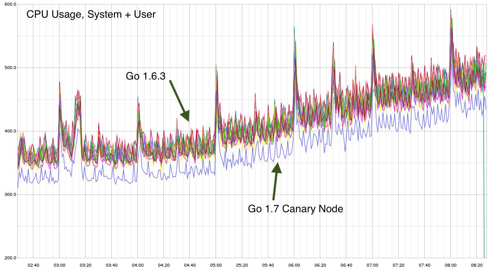
- Go 1.7：停顿时间控制在两毫秒以内
  - 从 1.6.3 切换到 1.7 时的停顿时间对比
    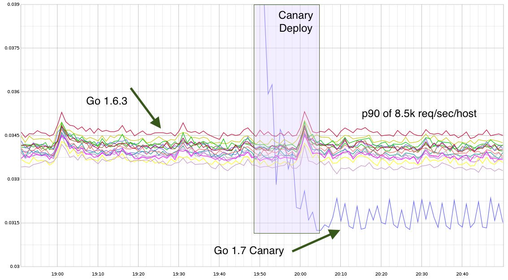
- Go 1.8：混合写屏障，停顿时间在半个毫秒左右
  - 

    ​          
  
- Go 1.9：彻底移除了栈的重扫描过程
  
  - 消除栈重扫，与 1.8.3 几乎一致 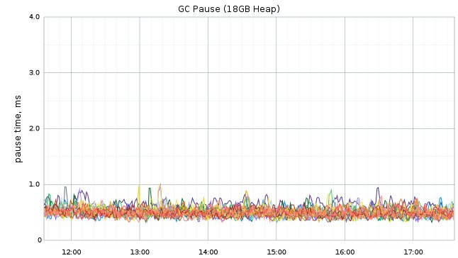
- Go 1.12：整合了两个阶段的 Mark Termination，但引入了一个严重的 GC Bug 至今维修，尚无该 Bug 对 GC 性能影响的报告
- Go 1.13：着手解决向操作系统归还内存的，提出了新的 Scavenger
- Go 1.14：替代了仅存在了一个版本的 scavenger，全新的页分配器，优化分配内存过程的速率与现有的扩展性问题，并引入了异步抢占，解决了由于密集循环导致的 STW 时间过长的问题。

可以用下图直观说明 GC 的演进历史：

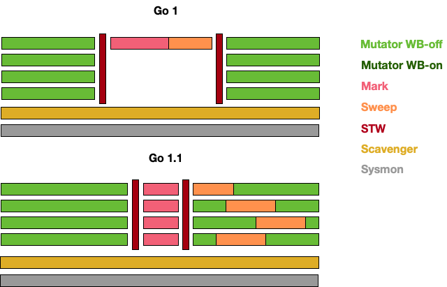

在 Go 1 刚发布时的版本中，甚至没有将 Mark-Sweep 的过程并行化，当需要进行垃圾回收时，所有的代码都必须进入 STW 的状态。而到了 Go 1.1 时，官方迅速的将清扫过程进行了并行化的处理，即仅在标记阶段进入 STW。这一想法很自然，因为并行化导致算法结果不一致的情况仅仅发生在标记阶段，而当时的垃圾回收器没有针对并行结果的一致性进行任何优化，因此才需要在标记阶段进入 STW。对于 Scavenger 而言，早起的版本中会有一个单独的线程来定期将多余的内存归还给操作系统。

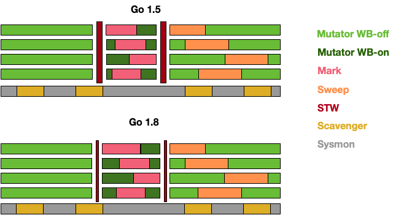

而到了 Go 1.5 后，Go 团队花费了相当大的力气，通过引入写屏障的机制来保证算法的一致性，才得以将整个 GC 控制在很小的 STW 内，而到了 1.8 时，由于新的混合屏障的出现，消除了对栈本身的重新扫描 STW 的时间进一步得以缩减。从这个时候开始，Scavenger 已经从独立线程中移除，并合并至系统监控这个独立的线程中，并周期性的向操作系统归还内存，但仍然会有内存溢出这种比较极端的情况出现，因为程序可能在短时间内应对突发性的内存申请需求时，内存还没来得及归还操作系统，导致堆不断向操作系统申请内存，从而出现内存溢出。

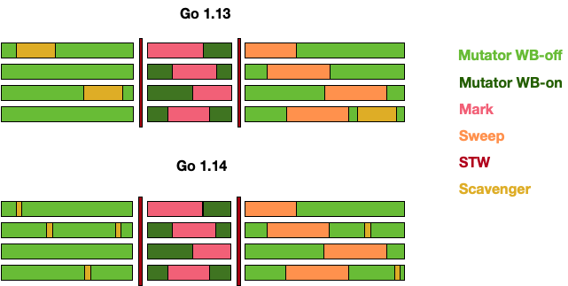

到了 Go 1.13，定期归还操作系统的问题得以解决，Go 团队开始将周期性的 Scavenger 转化为可被调度的 goroutine，并将其与用户代码并发执行。而到了 Go 1.14，这一向操作系统归还内存的操作时间进一步得到缩减。

### 17. Go GC 在演化过程中还存在那些其他设计？为什么他们没有被接受？

#### 并发栈重扫

TODO

#### ROC

TODO

### 18. 目前提供 GC 的语言以及不提供 GC 的语言有哪些？GC 和 No GC 各自的优缺点是什么？

从原理上而言，所有的语言都能够自行实现 GC，但从语言诞生之初就提供 GC 的语言例如：

- Python
- JavaScript
- Java
- Objective-C
- Swift

而不已 GC 为目标，被直接设计为手动管理内存、但可以自行实现 GC 的语言有：

- C
- C++

也有一些语言可以在编译期，依靠编译器插入清理代码的方式，实现精准的清理，例如 

- Rust

垃圾回收使程序员无需手动处理内存释放。从而能够消除一些需要手动管理内存才会出现的运行时错误：

1. 当在仍然有指向内存区块的指针的情况下释放这块内存时，会产生悬挂指针，从而后续可能错误的访问已经用做他用的内存区域。
2. 多重释放同一块申请的内存区域可能导致不可知的内存损坏。

当然，垃圾回收也会伴随一些缺陷，这也就造就了没有 GC 的一些优势：

3. 没有额外的性能开销
4. 精准的手动内存管理，极致的利用机器的性能

### 19. Go 对比 Java、V8 中 JavaScript 的 GC 性能如何？

无论是 Java 还是 JavaScript 中的 GC 均为分代式 GC。分代式 GC 的一个核心假设就是分代假说：将对象依据存活时间分配到不同的区域，每次回收只回收其中的一个区域。

#### V8 的 GC

在V8中主要将内存分为新生代和老生代。新生代中的对象为存活时间较短的对象，老生代中的对象为存活时间较长或常驻内存、或者占用内存较大的对象：

1. 新生代中的对象主要通过副垃圾回收器进行回收。该回收过程是一种采用复制的方式实现的垃圾回收算法，它将堆内存一分为二，这两个空间中只有一个处于使用中，一个处于闲置状态。处于是使用状态的空间称为From空间，处于闲置的空间称为To空间。分配对象时，先是在From空间中进行分配，当开始垃圾回收时，会检查From空间中的存活对象，并将这些存活对象复制到To空间中，而非存活对象占用的空间被释放。完成复制后，From空间和To空间的角色互换。即就是通过将存活对象在两个空间中进行复制。
2. 老生代则由主垃圾回收器负责。它的实现的是标记清扫过程，但略有不同之处在于它还会在清扫完成后对内存碎片进行整理，进而是一种标记整理的回收器。

#### Java 的 GC

Java 的 GC 称之为 G1，并将整个堆分为年轻代、老年代和永久代。包括四种不同的收集操作，根据代码行为选择性与配置选择性进行：

1. 年轻代收集周期
2. 老年代收集周期
3. 混合式收集周期
4. 完整 GC 周期
5. 在回收过程中，G1 会对停顿时间进行预测，调整 GC 的策略从而达到用户代码对停顿时间的要求。这四个周期的执行成本逐渐上升，优化得当的程序可以完全避免完整 GC 周期。

#### 性能比较

在 Go、Java 和 V8 JavaScript 之间比较 GC 的性能本质上是一个不切实际的问题。如前面所说，垃圾回收器的设计权衡了相当多方面的因素，除此之外同时还受语言自身设计的影响，因为语言的设计也直接影响了程序员编写代码的形式，也就自然影响了产生垃圾的方式。
但总的来说，他们三者对垃圾回收的实现都需要 STW，并均已达到了用户代码几乎无法感知到的状态（小于一毫秒）。当然，随着 STW 的减少，垃圾回收器会增加 CPU 的使用率，这也是程序员在编写代码时需要手动进行优化的部分，即充分考虑内存分配的必要性，减少过多申请内存带给垃圾回收器的压力。
